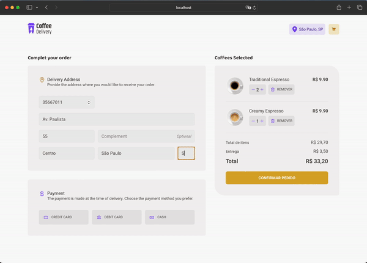

# CoffeeShop

CoffeeShop is a simple React application designed to simulate a coffee shop checkout process. The goal of this project is to help learners understand fundamental React principles by building an interactive shopping cart and checkout system.

## Table of Contents
- [Project Overview](#project-overview)
- [Features](#features)
- [Learning Objectives](#learning-objectives)
- [Project Structure](#project-structure)
- [Installation](#installation)
- [Usage](#usage)
- [Dependencies](#dependencies)

## Project Overview
The CoffeeShop app allows users to add different types of coffee to their cart, adjust quantities, and proceed to checkout. At the end of the checkout process, a confirmation page is displayed with a summary of the order.

## Features
- Add and remove coffee items from the cart
- Adjust the quantity of each coffee item
- Calculate total price including delivery
- Form validation for checkout details
- Confirmation page with order summary

## Learning Objectives
This project helps in learning:
- How to create and manage state with React Context API.
- Handling form validation with React Hook Form and Zod.
- Navigating between pages using React Router.
- Building reusable components like buttons and forms.
- Organizing and structuring React projects.

## Project Structure
The main structure of the app is organized into several TypeScript files:
- `index.tsx`: Entry point of the app where the main logic is implemented.
- `CartContext.tsx`: Contains the context for managing the shopping cart state.
- `Checkout.tsx`: Contains the Checkout component, which handles the checkout process.
- `Confirmation.tsx`: Handles the confirmation page, displaying the order summary.
- `components/`: Contains reusable components like buttons and form inputs.
- `pages/`: Contains the main pages of the app (Checkout, Confirmation, Home).

## Dependencies

The app uses the following packages:

- `react`: Core React library.
- `react-router-dom`: For routing and navigation.
- `react-hook-form`: For form handling and validation.
- `zod`: For schema validation.
- `styled-component`s: For styling components.

## Installation
To run this project on your local machine, follow these steps:

1. **Clone the repository**:
  ```sh
   git clone <url-do-repositorio>
   cd CoffeeShop
  ```
2. **Install dependencies**:
  ```bash
    npm install
  ```

## Usage

The app consists of a shopping cart where users can add different types of coffee, adjust quantities, and proceed to checkout. The checkout form validates user input and, upon successful submission, navigates to a confirmation page displaying the order summary.




## License

This project is open-source and available under the MIT License.